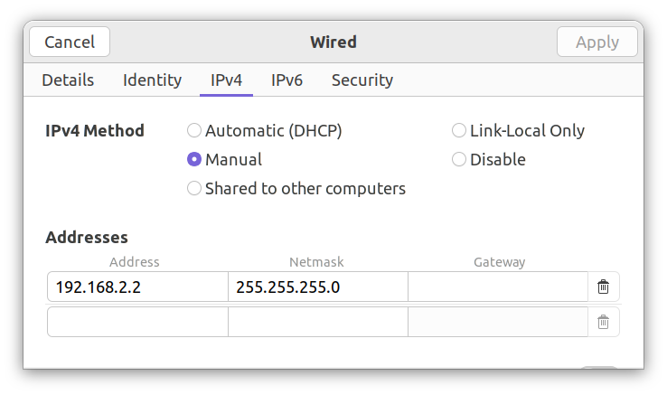

# booms-gse

`booms-gse` is a compilation of python tools to interact with the BOOMS

-----

**Table of Contents**

- [Setup](#setup)
- [Basic Usage](#basic-usage)
- [`bgse-computer` Subcommands](#bgse-computer-subcommands)
- [`mm_gse` Usage](#mm_gse-usage)
- [Instrument GSE Usage](#instrument-gse-usage)

## Setup

These instructions should be cross-platform except where
specifically noted. Be aware that they have only been tested in
Ubuntu 22.04 using Python 3.11, and the instructions may differ
slightly for other operating systems.

### Installation

First, be sure you have a Python version of 3.9 or greater installed.
This example uses Python 3.11. Just change the instructions
to match your version number. For Windows specific instructions
about running python in the command line, you can reference
[Python Docs: 4.8. Python Launcher for Windows](https://docs.python.org/3/using/windows.html#python-launcher-for-windows).

To check your python version in Linux or Mac, run

```bash
python --version
```

And to check your python version in Windows, run

```console
py --version
```

Clone the [`booms-gse` GitHub Repo](https://github.com/bagriffith/booms-gse).
You can go to the that page and click `Code` then `Download ZIP`, and
manually extract the zip in the file Explorer. If your computer has
git installed, you can instead use the command.

```bash
git clone https://github.com/bagriffith/booms-gse.git
```

Open that directory in the terminal or command line.

Create a virtual environment with `venv` specifically for these
GSE tools. There are dependencies for old versions of several
python packages. Without a virtual environment, this creates a
risk for breaking other python scripts and avoids future updates
breaking these tools.

To create and activate a virtual environment, call the `venv` module
from your python installation. **Be sure to activate the virtual environment
every time you run part of this package.**
For more detailed instructions on virtual environments, refer to the
[Python docs: 12. Virtual Environments and Packages](https://docs.python.org/3/tutorial/venv.html).

For Linux or Mac

```bash
python -m venv .venv
source .venv/bin/activate
```

And for Windows

```console
py -m venv .venv
.venv\Scripts\activate.bat
```

Then install the `booms-gse` package with `pip`.

```bash
pip install booms-gse
```

To replay the flight computer logged `.bin` files with these tools,
you will need compile `playback` binary from `middleman`. It is only
possible to compile this tool on Linux. On Windows, skip this step.
*This feature is not needed for the preflight checkout.*
The source is available at the
[`middleman` GitHub repository](https://github.com/ayshih/middleman).
Compilation instructions are in that repository. Once completed,
define the `BOOMS_PLAYBACK` environment variable to point to that binary.

```bash
export BOOMS_PLAYBACK="/path/to/playback"
```

### Connecting to the Flight Computer

**Physical Connection:** Connect the flight computer and your
computer to an Ethernet switch. It is possible to connect more devices,
but read the directions bellow for instructions on configuring the IP
addresses.

**Network Configuration:** The BOOMS flight computer uses the IP address
`192.168.2.101/24`. Your Ethernet interface needs to
be assigned to a different static IP in that subnet.
There is no other requirement except that the address is unique
among all computers connected to the switch at one time. These
instructions will use the address `192.168.2.2`. The netmask must be
set to `255.255.255.0`.

For Ubuntu, below is a screenshot of the network manager with this
configuration. For more information on networking configuration in
Ubuntu, see the
[Ubuntu Desktop Docs: Manually set network settings](https://help.ubuntu.com/lts/ubuntu-help/net-manual.html.en).



For Windows, follow the in Windows Support instructions
[Change TCP/IP settings](https://support.microsoft.com/en-us/windows/change-tcp-ip-settings-bd0a07af-15f5-cd6a-363f-ca2b6f391ace).
In Windows 11, follow the directions below. (These have not
been verified yet, but should be roughly correct.)

1. Select `Start`, then type settings.
   `Select Settings` > `Network & internet`.
2. Select `Ethernet`, and select the Ethernet interface connected to the
   switch with the flight computer.
3. Select `IP assignment`, then `Edit`.
4. Under `Edit` network `IP settings` or `Edit IP settings`,
   choose `Manual`, then turn on `IPv4`.
5. In the `IP address` box enter `192.168.2.2`.
6. In the `Subnet mask` box, enter `255.255.255.0`.
7. Select Save.

The simplest way to route the flight computer UDP packets to your
computer's IP address using a command in `mm_gse`. The box `Remote IP`
should be the correct value `192.168.101.2`. In the box `Self IP`
enter your computer IP `192.168.2.2`. Then press the button
`Route telemetry`.


*These instructions are not necessary to run the preflight checkout*, and
may be skipped. Setting the packet address is necessary because by default
the flight computer directs packets to the multicast address `239.255.0.1`.
You can subscribe to this address. The instructions in Linux are below.

```shell
sudo ip addr add 239.255.0.1 dev enx3c18a003add2 autojoin
```

The switch only sends UDP packets to one port, so this cannot be used
with multiple computers subscribed. It is possible to instead
subscribe using `socat`.

```bash
socat STDIO UDP4-DATAGRAM:239.255.0.1:60501,ip-add-membership=239.255.0.1:192.168.2.2
```

## Basic Usage

There are two main GSE utilities included in this package:

- Instrument GSEs: `bgse-imag` for the imagers and `bgse-spec` for the
  spectrometers
- `bgse-computer`: Used to route or process the flight computer's UDP packets.

`bgse-computer` contains several subcommands. These can be chained
together and will run in parallel. For a full list of these commands run
the help dialog.

```bash
bgse-computer --help
```

The most common use case would be completing the full computer and instrument
checkout. First, [connect to the flight computer](#connecting-to-the-flight-computer).
Packets need to be sent to the web interface, `mm_gse`, and each
instrument's data needs to be sent to separate log files. This uses a
two part multicommand. For this example the instrument data will
be placed inside the directory `test-data` in the terminal's working
directory. `mm_gse` will also launch in your browser. Leave this running
until all verification is finished.

```bash
bgse-computer record ./test-data mm_gse --show
```

After reviewing `mm_gse`, the full instrument data should be examined in the
appropriate GSE. Launch and evaluate results in the imager GSE first. Run
`bgse-imag` selecting each instrument data log `test-data/imag_X.dat`.
(For `X` being the imager number 0-6 corresponding to letters A-G.)

```bash
bgse-imag ./test-data/imag_0.dat
```

Then repeat for the spectrometers using `bgse-spec`. The spectrometer data
is stored in log files `test-data/spec_X.dat` (For `X` being the spectrometer
number 0-2 corresponding to S1-S3.)

```bash
bgse-spec ./test-data/spec_0.dat
```

## `bgse-computer` Subcommands

There are other useful commands that can be called in `computer-gse`.
First, to modify the UDP packet source, add the `--address` and `--port`
flags before any subcommands. This can be useful if receiving
packets forwarded by another computer connected to the GSE or if
the `playback` playback is used.

```bash
bgse-computer --address BOOMS_COMPUTER_IP --port BOOMS_COMPUTER_PORT
```

Instead of using a network source for the UDP packets, a
flight computer logged `.bin` file can be replayed. This
is implemented through the `playback` binary in the `middleman`
repository. Follow the [setup directions](#connecting-to-the-flight-computer)
to compile and set the necessary environment variable.
If this fails, expect a `RuntimeError` to be raised.

Adding a source file with the `--from_file` enables this playback.
The relative speed is set using the `--speed` flag and is `1.0`
or real time by default.

```bash
bgse-computer --speed 1.0 --from_file PATH_TO_PACKET_LOG
```

There is a maximum speed set by how quickly
`playback` will be able to process and send packets. Higher speeds
can be set, but will not be achieved. Setting a very high playback
speed, like `99999` can be used to process packets as quickly as
possible when extracting one instruments data to a file.

### Forwarding UDP packets

The `forward` subcommand is used to send the UDP packets to a new
address. This could be a different port on the same computer, using
a loopback address like `172.0.0.1`. It could also be another computer
running an instance of this GSE processor. For example, one person
could be reviewing the `mm_gse` output while a second person examines
each instrument GSE.  

```bash
bgse-computer froward TARGET_IP TARGET_PORT
```

### Forwarding Instrument Serial

Another method to send data to a second computer is forwarding one
instruments data through a serial port. This can be used to send
data to a computer running an older version of the instrument GSEs.

```bash
bgse-computer serial 0xC0 /dev/ttyUSB0
```

### Writing Instrument Serial to a File

The `record` subcommand extracts data to a file for replay
through an instrument GSE. This can be done live or after the fact. There
will be a separate file for each instrument.

```bash
bgse-computer record ROOT_LOG_PATH
```

## `mm_gse` Usage

The `middleman` GSE or `mm_gse` provides a diagnostic GUI for the
flight computer output. It is served through a bokeh server. Be aware
that the performance will suffer if a long duration of data (> TODO hours).

It can be launched two ways. To have the `bgse-computer` can be used handle the
forwarding and allow subcommands to run in parallel. It is launched with the
`mm_gse` subcommand. Add `--show` option to launch browser tab.
TODO, check this: it may not possible to send commands, including
Route Telemetry if the packets have been forwarded to a device
not connected to the flight computer subnet.

```bash
bgse-computer mm_gse
```

The second option is to run the bokeh server directly. You'll need
to configure variables in the file to select the IP and port of the
flight computer. They will not be correct by default, and these
changes will break the `bgse-computer` version. This method is necessary
needed to run an older version of `mm_gse`.

```bash
bokeh serve PATH_TO_MODULE/computer_gse/mm_gse.py
```

## Instrument GSE Usage

Two GSEs display full diagnostics from each instrument.
Of note, these aggregated spectra, which is not available in `mm_gse`.
These were both intended for direct connection to an instrument via serial,
and only minimal changes have been made to make them compatible
with `bgse-computer`.

The two GSEs can be with either `bgse-imag` or `bgse-spec` for the
imager and spectrometer GSE, respectively. The flags and arguments
are otherwise identical.

With no flags, the GSE will load data from a file that is written after
the GSE launches.

```bash
bgse-imag imag.dat
bgse-spec spec.dat
```

### Running over serial

If connected to the instrument over a serial port, either by direct
connection to the instrument or another computer sending serial with
`bgse-computer`, use the `-s` flag. In Linux, a USB serial adapter
should be located at `/dev/ttyUSB0` with the number incrementing in
the order the USB adapters were connected.

```bash
bgse-imag -s /dev/ttyUSB0
```

### Replaying data from a file

To replay a file from the beginning add the `-r` flag. To set the speed,
add the `-s` flag as specify the speed relative to real time. If too high
of a number is set, data will instead be read as quickly as possible.

```bash
bgse-imag -s 10.0 -r imag.dat
bgse-spec -s 10.0 -r spec.dat
```
